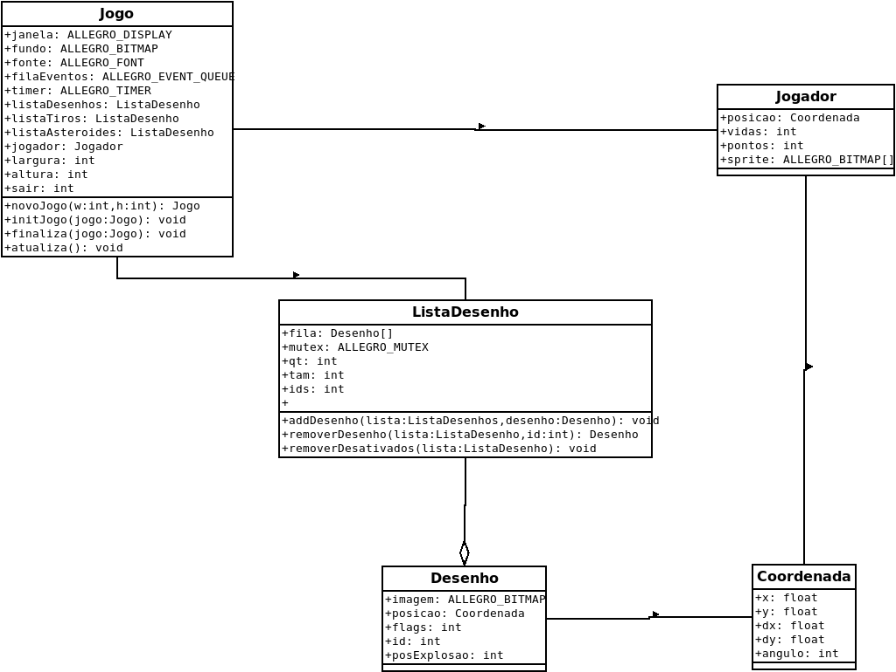

# AllegroAsteroidsTzil
Allegro C lang Asteroids game 
# Dependências
  Allegro5
# Para compilar
  gcc main.c -o asteroids -lm -lallegro -lallegro_image -lallegro_font -lallegro_ttf -lallegro_audio -lallegro_acodec
# Para executar
 ./asteroids

## Bibliotecas:
Allegro5 e suas dependências (Imagens, audio, fontes), Stdlib, Limits, Math ,Time

##  Estruturas:

## Jogo:

Estrutura Principal do programa, responsavél por armazenar e controlar os dados relacionados a interface gráfica e estrutura de dados utilizadas durante a execução do programa

## Desenho:

Estrutura responsavél por armazenar o sprite, a posicão do elemento na tela, e outros valores auxiliares na execução de diretivas internas do progarma

## Coordenada:

Estrutura utilizada para armazenar a posição do elemento na tela, sendo utilizada principalmente pela estrutura Desenho e na renderização dos sprites durante a execução do programa

## Lista Desenho:

Estrutura de Dados do tipo ArrayList Responsavél por armazenar os desenhos exibidos na tela 

## Jogador:

Estrutura responsavél por armazenar os dados relacionados ao jogador, contendo o sprite a ser renderizado na tela , a Coordenada do elemento na tela, a pontuação e a vida do jogador

# Esquema das Estruturas:

# Funções e Procedimentos Utilizadas da Biblioteca Allegro e Dependências

## Procedimentos de Inicialização:

al_init() : Função responsavél por inicializar os componetes básicos da biblioteca 

al_init_image_addon() : Função responsavél por inicializar os componetes relacionados a maipulação de imagens da biblioteca Allegro_Images    

al_init_font_addon() : Função responsavél por inicializar os componentes relacionados a manipulação de fontes de texto da biblioteca Allegro_Fonts

al_init_ttf_addon() : Função responsavél por inicializar os componentes relacionados a manipulacão de fontes true type (ttf) da biblioteca Allegro_ttf

al_init_acodec_addon() : Função responsavél por inicializar os componentes relacionados ao controle de audio da biblioteca Allegro_Acodec

## Procedimentos de Instalação:

al_install_keyboard() : Resposavél por preparar a execução de eventos relacionados ao teclado

al_install_audio(): Resposavél por preparar a execução de eventos relacionados ao som

al_register_event_source : Responsavél por interpretar os eventos vindos dos dispositivos de entrada e saída

## Funções de Instânciação:

al_create_bitmap : Responsavél por instânciar um ponteiro para uma estrutura do tipo ALLEGRO_BITMAP

al_create_thread : Responsavél por instânciar um ponteiro para uma estrutura do tipo ALLEGRO_THREAD

al_create_timer : Responsavél por instânciar um ponteiro para uma estrutuar do tipo ALLEGRO_TIMER

al_create_display : Responsavél por instânciar um ponteiro para uma estrutura do tipo ALLEGRO_DISPLAY

al_create_event_queue : Responsavél por instânciar um ponteiro para uma estrutura do tipo ALLEGRO_EVENT_QUEUE

## Funcões de Carremagento de Disco:

al_load_font : Carrega um arquivo do tipo ttf (True Type Fonts) para uma variavél do tipo ALLEGRO_FONT

al_load_bitmap : Carrega um arquivo de imagem para uma variavél do tipo ALLEGRO_BITMAP

al_load_sample : Carrega um arquivo de audio para uma variavél do tipo ALLEGRO_SAMPLE

## Procedimeontos de Remoção (Destrução)

al_destroy_sample : Desintância uma variavél do tipo ALLEGRO_SAMPLE

al_destroy_font : Desintância uma variavél do tipo ALLEGRO_FONT

al_destroy_event_queue : Desinstância uma variavél do tipo ALLEGRO_EVENT_QUEUE

al_destroy_display : Desinstância uma variavél do tipo ALLEGRO_DISPLAY

al_destroy_thread : Desinstância uma variavél do tipo ALLEGRO_THREAD

al_destroy_bitmap : Desintância uma variavél do tipo ALLEGO_BITMAP

## Porcedimentos/Funções e Recuperação de Definição (Get  e Set):

al_set_window_title : Difine o título de uma Janela

al_set_target_bitmap : Define qual variavél do tipo ALLEGRO_BITMAP vai ser usada para as funçoes de desenho(draw)

al_get_backbuffer : Retorna um ponteiro para a janela utilizada ( ALLEGRO_DISPLAY )

## Procedimentos de Desenho (Draw):

al_draw_rotated_bitmap : Desenha um elemento do tipo ALLEGRO_BITMAP com o atributo de ângulo

al_draw_bitmap : Desnha um elemento do tipo ALLEGO_BITMAP

al_draw_textf : Desenha um texto formatado semelhante ao precedimento printf()

## Procedimentos/Funções Orientados à Eventos:

al_wait_for_event : Responsavél por aguardar a chegada de um evento do tipo ALLEGRO_EVENT registrado em uma variavél do tipo ALLEGRO_EVENT_QUEUE

al_is_event_queue_empty : Verifica se uma variavél do tipo ALLEGRO_EVENT_QUEUE está vazia

al_start_timer : registra a inicialização de uma variavél do tipo ALLEGRO_TIMER

al_start_thread : Inicializa uma variavél do tipo ALLEGRO_THREAD (processo de um processo)

al_lock_mutex : Responsavél por travar um  ou mais endereços de memória 

al_unlock_mutex : Responsavél por destravar um ou mais endereços de memória

## Demais Procedimentos:

al_play_sample : executa um audio do tipo ALLEGRO_SAMPLE

al_flip_display : Atualiza a tela 

al_reserve_samples : Reserva uma quantidade x de canias de audio no mixer principal no Sistema Operacional

# Funçõe e Procedimentos das Bibliotecas Pessoais:

## JogoThreads.h

void teclado(ALLEGRO_THREAD *thread,void *param): Procedimento executado em uma thread para controlar os eventos vindos dos dispositivos de entrada do Sistema Operacional

void atualizaPosicao(Coordenada *posicao) : Responsavél por atualizar as coordenadas do Jogador

void atualizaDesenhos(ListaDesenho *lista,ALLEGRO_BITMAP *sprite , Coordenada *posicao): Responsavél por atualizar os desenhos á serem exibidos na tela

## Jogo.h

void initJogo(Jogo *novo): Responsavél por preparar e inicializar as dependências para a execução do programa

Jogo *novoJogo(int w,int h) : Respinsavél por instânciar e alocar um ponteiro para uma estrutura do tipo Jogo

void atualiza() : Responsavél por atualizar a tela

void finaliza() : Responsavél por disinstânciar as variavéis da estrutura do tipo Jogo
